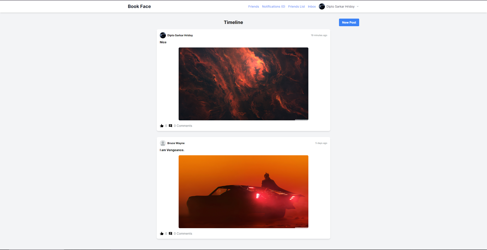
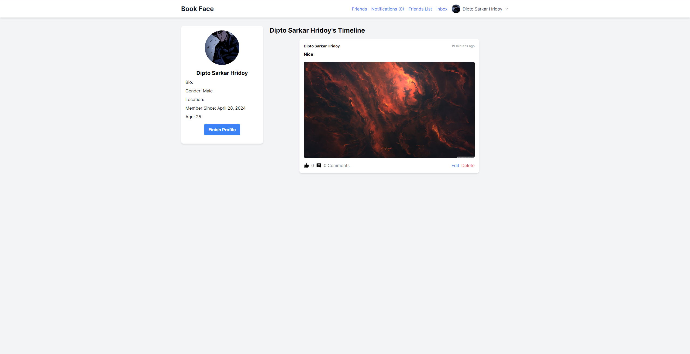
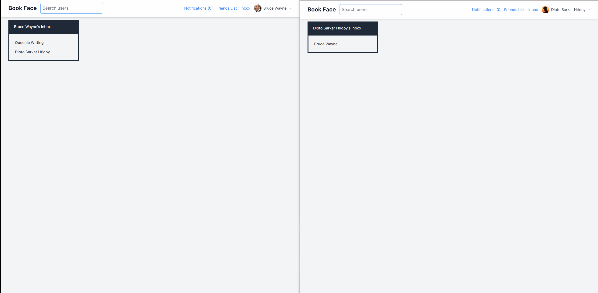

# Book Face

## Introduction

Book Face is a social media application built with Ruby on Rails. It is inspired by popular social media platforms, 
featuring core functionalities such as user authentication, profiles, posts, 
adding friends, real time chatting, liking, and commenting.

## Live Demo

You can see a live version of the app **[here](https://book-face.onrender.com)**.
Please note that the app is hosted on a free tier and may take a moment to load if it has been inactive.

## Features

- **User Authentication:** Implemented with Devise gem. Users must sign in to see anything except the sign-in page.
User can also use google sign in.
- **User Profiles:** Users can create a profile with a profile picture. The profile page contains their profile 
information, profile photo, and posts.
- **Friends:** Users can send friend requests to other users.
- **Posts:** Users can create posts with or without adding images. Each post displays the content, author, comments, and likes.
- **Likes and Comments:** Users can like posts and comment on them.
- **Chatting:** Users can chat only with their added friends in real time.
- **Newsfeed:** An index page for posts shows all recent posts from the current user and users they are friends with.
- **User Index:** An index page for users shows all users and buttons for sending friend requests and cancel 
request if they are not already in the friend list. User can also accept or reject friend requests.
- **Email Notifications:** Action mailer sends a welcome email when a new user signs up. Users can also reset their 
password.

## Technology Used
- Ruby on Rails
- Hotwire
- PostgreSQL
- Devise
- Action Cable
- Action Mailer
- Active Storage
- TailwindCSS
- Redis
- Cloudinary

## Screenshots

## Future Features

- Real-time updates for newsfeed and notifications
- Users can create group chat

## Getting Started

These instructions will get you a copy of the project up and running on your local machine for development and testing purposes.

### Prerequisites

You need to have Ruby and Rails installed on your machine. See [this guide](https://guides.rubyonrails.org/getting_started.html#creating-a-new-rails-project-installing-rails) for instructions on setting up Rails.

### Installing

1. Clone the repository: `git clone https://github.com/DiptoSarkar182/book_face.git`
2. Navigate into the project directory: `cd book_face`
3. Install the dependencies: `bundle install`
4. Set up the database: `rails db:create db:migrate`
5. Start the server: `rails server`
6. Visit `http://localhost:3000/` in your browser to access the application.

<a target="_blank" href="https://icons8.com/icon/37975/love">Love</a> icon by <a target="_blank" href="https://icons8.com">Icons8</a>